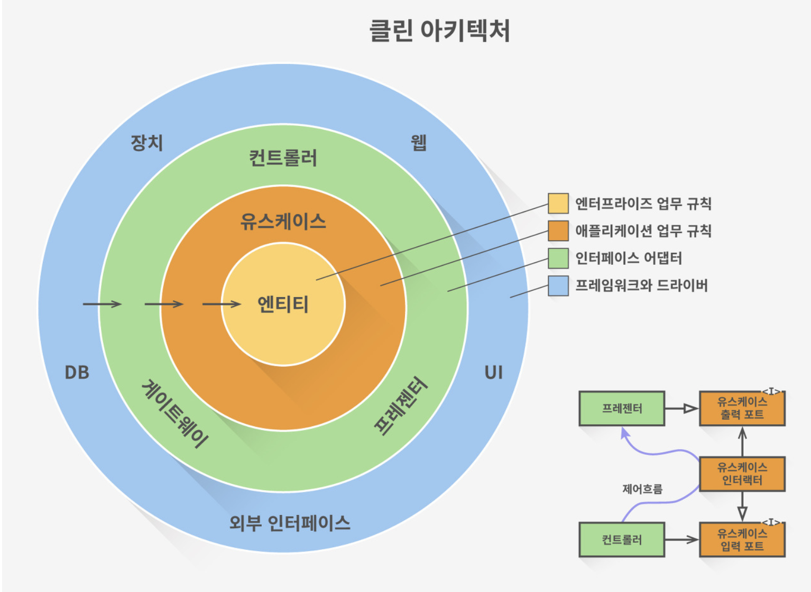
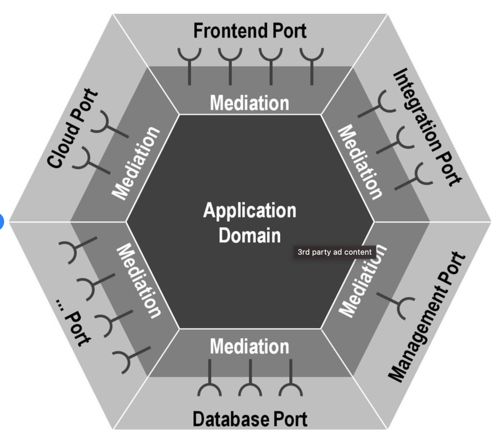

#Chapter 20. 업무 규칙 (Business Rule)

> 사업적으로 수익을 얻거나 비용을 줄일 수 있는 규칙 또는 절차

    - 업무규칙은 컴퓨터상으로 구현했는지 여부와 관계 없다 (ex. 대출에 N% 이자를 부여한다)
    - 핵심 업무 규칙(Critical Business Rule): 사업 자체에 핵심적이며 시스템과는 관계없다
    - 핵심 업무 데이터(Critical Business Date): 핵심 엄무 규칙에 필요한 데이터
    - 핵심 업무 규칙과 데이터는 본질적으로 결합되어 있고 우리는 이를 엔티티(Entity) 라고 한다
 

1. Entity
> 시스템 내부의 객체로서, 핵심 업무 데이터를 기반으로 동작하는 작은 핵심 업무 규칙을 구체화한다

- 핵심 업무 데이터를 직접 포함하거나 쉽게 접근 할 수 있다
- 인터페이스는 핵심 업무 데이터를 기반으로 동작하는 핵심 업무 규칙을 구현한 함수들도 구성
- 업무의 대표자로서 독립적으로 존재한다
- 데이터베이스, 사용자 인터페이스, 서드파티 프레임워크에 대한 고려사항들도 인해 오염되서는 안된다
 

2. Use case
> 자동화된 시스템이 동작하는 방법을 정의하고 제약함으로써 수익을 얻거나 비용을 줄이는 업무 규칙

    예시 (신규 대출 서비스) : 신청자의 신용도가 500보다 낮으면 대출 제공하지 않는다
        - 신청자의 신청정보를 입력하는 페이지를 띄운다 
        - 신청자의 정보를 검증한다
        - 신청자의 신용도를 확인한다
        - 대출 화면으로 이동한다 

    - 사용자가 제공해야하는 입력, 출력을 생성하기 위한 처리, 사용자에게 보여줄 출력의 단계로 이루어져 있다
    - 애플리케이션에 특화된 업무 규칙을 설명한다
    - 유스케이스는 사용자 인터페이스를 기술하지 않는다
    - 유스케이스(저수준: 단일 애플리케이션에 특화)는 엔티티(고수준: 일반화된 것)의 핵심규칙을 언제 어떻게 호출할지 명시한다 
    - 엔티티(고수준)는 유스케이스(저수준)에 의존하지 않는다

3. 요청 및 응답 모델
    - 유스케이스는 단순히 요청 데이터 구조를 입력받아 출력 데이터 구조를 반환한다
        - 입력과 출력 데이터 구조는 어떤 것(HttpRequest, HttpResponse)에도 의존하지 않는다
        - 웹에 대해서 알지 못한다 
    - 엔티티를 가르키는 참조를 가져서는 안된다
        - 다른 목적을 지니고 완전히 다른 이유로 변경될 것이다

4. 결론
> 업무 규칙은 소프트웨어 시스템이 존재하는 이유이며 핵심적인 기능이다.
> 사용자 인터페이스나 데이터베이스 같은 저수준의 관심사에 오염되서는 안된다 
> 업무규칙은 심장부이고 그외의 모든 코드들은 이 업무 규칙에 플러그인 되어야한다 

[hexagonal architecture] 